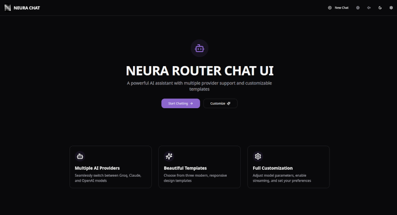

# Neura AI Open Source Chatbot UI

## Overview

Neura AI is a modern, customizable AI chatbot interface that supports multiple language models and visual templates. It's built with React, TypeScript, and modern web technologies to provide an exceptional user experience.

## App Preview

### Home Page


### Desktop Chat View


### Mobile Chat View


## Features

- **Switch Easily Multiple AI Providers**: Seamlessly switch between Groq, Neura, Claude, Flowise, OpenRouter or OpenAI
- **Customized System Prompts**: Provide custom instructions to the AI model that will be applied to all conversations
- **Customizable Templates**: Choose from three modern visual templates (Minimal, Vibrant, and Elegant)
- **Dark/Light Mode**: Each template has both light and dark variants
- **Conversation Management**: Save, browse, and manage multiple chat conversations
- **Persistent Storage**: Database-backed conversation history using Prisma ORM
- **Message Streaming**: Real-time message streaming for a responsive chat experience
- **Responsive Design**: Works smoothly on desktop and mobile devices
- **Customizable Settings**: Adjust parameters like temperature, model selection, and more
- **Auto-fit Input**: Automatically expands as you type, providing a comfortable writing experience while maintaining a clean interface.

## Comming Soon
- Messages Token Counter: Displays the number of tokens used in each message.
- Follow-up Prompts: Suggest follow-up questions to enhance user engagement.
- File Upload Support: Upload and process various file types including TXT, PDF, DOC, DOCX, CSV, JSON, and XML.
- Image Upload Support: Upload and process image files with preview functionality.
- Image Display: The chatbot can display images received in the conversation.
Attachment Preview: Shows thumbnails for uploaded images and file information for documents.
- File Size Limits: Enforces configurable size limits based on Flowise settings.
Drag-and-Drop Functionality: Supports drag-and-drop for uploading files and images.
- AI Message Copying: Users can easily copy AI-generated or user messages.
- Boxed/Full Screen Mode: Allows users to switch between a boxed chat interface and a fullscreen experience.
- Personalized Welcome Message: Allows defining a personalized welcome message to greet users upon entering the chat.
Visual Feedback: Displays loading animations and progress indicators during operations.
- Markdown Support: Responses are displayed with Markdown formatting to improve readability and presentation.
Embed Feature: Easily embed the chatbot on any webpage with a simple script tag.


## Getting Started

### Prerequisites

- Node.js 16.x or higher
- npm or yarn package manager

### Installation

```bash
# Clone the repository
git clone https://github.com/adolfousier/neura-spark-listener-chatbot-ui
cd neura-ai

# Install dependencies
npm install
# or
yarn install
```

### Environment Variables

Create a `.env` file in the root directory with the following variables:

```
# Required: At least one API key
VITE_GROQ_API_KEY=your_groq_api_key
VITE_OPENAI_API_KEY=your_openai_api_key
VITE_CLAUDE_API_KEY=your_claude_api_key
VITE_FLOWISE_API_KEY=your_flowise_api_key
VITE_OPENROUTER_API_KEY=your_openrouter_api_key

# Database configuration
DATABASE_URL="file:./dev.db"  # SQLite database path

# Optional with defaults
VITE_BACKEND_SERVICE_PROVIDER=groq  # Defaults to 'groq' if not provided
VITE_GROQ_API_MODEL=deepseek-r1-distill-llama-70b  # Default model for Groq
VITE_STREAM_ENABLED=true  # Enable/disable streaming responses
VITE_REASONING_FORMAT=parsed  # Format for AI reasoning
VITE_FLOWISE_CHATFLOW_ID=  # Flowise Chatflow ID
```

### Running the Development Server

```bash
npm run dev
# or
yarn dev
```

Open [http://localhost:8080](http://localhost:8080) in your browser to see the application.

### Building for Production

```bash
npm run build
# or
yarn build
```

The optimized production build will be in the `dist` folder.

## Architecture

The project is structured as follows:

- `/src/components` - UI components
- `/src/context` - React context providers
- `/src/hooks` - Custom React hooks
- `/src/lib` - Utility functions
- `/src/pages` - Page components
- `/src/services` - API services
- `/src/types` - TypeScript type definitions
- `/prisma` - Database schema and migrations

## Database Setup

This project uses Prisma ORM with SQLite for persistent storage of conversations and messages.

### Initialize the Database

```bash
# Install Prisma CLI if not already installed
npm install -g prisma

# Generate Prisma client
npx prisma generate

# Create and apply migrations to set up the database
npx prisma migrate dev --name init
```

### Database Schema

The database schema includes two main models:

- `Conversation`: Stores chat conversation metadata
- `Message`: Stores individual messages within conversations

You can view and modify the schema in the `prisma/schema.prisma` file.

## Contributing

Contributions are welcome! Please follow these steps:

1. Fork the repository
2. Create a feature branch (`git checkout -b feature/amazing-feature`)
3. Commit your changes (`git commit -m 'Add some amazing feature'`)
4. Push to the branch (`git push origin feature/amazing-feature`)
5. Open a Pull Request

### Code Style

We use ESLint and Prettier for code formatting. Please ensure your code follows our style guidelines by running:

```bash
npm run lint
npm run format
```

## License

This project is licensed under the MIT License - see the LICENSE file for details.

## Contribuitions
We welcome contributions! Please see our [contributing guidelines](contributing.md) for more information. If you like this project, please consider giving us a star!

## Acknowledgments

- This project uses [shadcn/ui](https://ui.shadcn.com/) for UI components
- Built with [Vite](https://vitejs.dev/), [React](https://reactjs.org/), and [TypeScript](https://www.typescriptlang.org/)
- Styled with [Tailwind CSS](https://tailwindcss.com/)
- Database with [Prisma ORM]([Prisma ORM](prisma.io/)